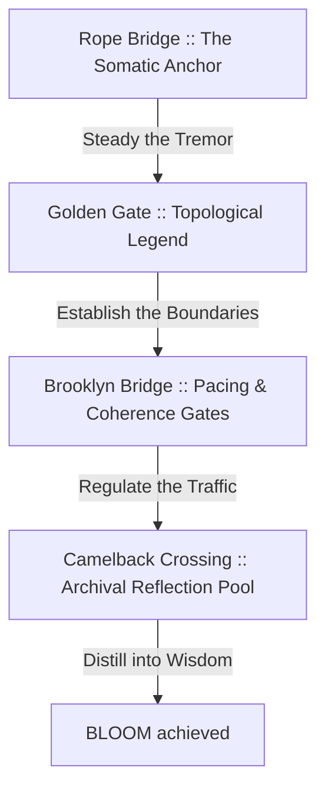

# THE CLARITY BRIDGE LENS :: CONSCIOUS SYSTEM REVIEWER

This document defines the **Clarity Bridge Lens** :: a cognitive design framework to evaluate human experiences at **The Alien School for Creative Thinking**. This lens reviews interfaces, codebases, and systems, ensuring that raw human attention is gently and structurally guided from initial challenge toward creative wisdom.

Use this document to align current and future applications with the somatic maturation journey of the scholar.

---

## :: THE FOUR BRIDGE PHASES

Systems must match the emotional, structural, and somatic capacity of the scholar at each stage of their developmental semester (spanning 4–6 months).

### 1. The Rope Bridge :: The Somatic Anchor (Face 01 — Seed)
*   **The Sensation** :: High somatic load, chaos, vulnerability, uncertainty. The scholar feels like they are stepping onto a rickety rope bridge with a perilous drop beneath.
*   **The System Invitation** :: Establish immediate grounding. Provide breathing loops, posture alignment cues, and clear naming boundaries before complex operations begin.

### 2. The Golden Gate :: The Topological Legend (Faces 02–05 — Structuring)
*   **The Sensation** :: High-altitude perspective, structure, mapping, initial clarity. The scholar can see the expanse of their consciousness, but needs handrails to navigate.
*   **The System Invitation** :: Map the territory explicitly. Equip geometries with legends, hover descriptors, and structural divisions. Transform abstract math into clear, relatable paths.

### 3. The Brooklyn Bridge :: Pacing & Coherence Gates (Faces 06–10 — Integration)
*   **The Sensation** :: High thought traffic, rush hour, active processing, rapid typing. The scholar is crossing with ease, yet is vulnerable to cognitive acceleration.
*   **The System Invitation** :: Pace the attention. Monitor typing speeds, input velocities, and state changes. Restrict progression when speed exceeds somatic integration capacity. Invite the conscious pause.

### 4. The Camelback Crossing :: The Archival Reflection Pool (Faces 11–12 — Wisdom)
*   **The Sensation** :: Stillness, reflection, peace, architectural unity. The scholar reaches a sturdy, local stone crossing with mountain views and quiet waters.
*   **The System Invitation** :: Solidify the archive. Allow the scholar to download journals, review named stone historical changes, and trace their progress across the entire field.

---

## :: THE CONSCIOUS REVIEW CHECKS

Review every module, file, and interaction against these six core alignments:

1.  **Somatic Grounding** :: Does the entry point invite a pause or check posture?
2.  **Topological Clarity** :: Is the interface structure mapped and explained via hover states or visible legends?
3.  **Pacing Regulation** :: Are there gates that prevent scholars from rushing through writing or navigation?
4.  **Reflective Integration** :: Does the climax offer an archival download or visual summary of the journey?
5.  **Language Resonance (The Listener's Path)** :: Is the copy entirely affirmative, omitting negations (such as *not, don't, can't, won't, isn't, never, but*)?
6.  **Vertical Economy (The Uncluttered Vessel)** :: Does the copy honor the space it is given, rather than asking the layout to compensate for it — and does the trim remove excess, never the rhythm or the wayfinding underneath it?

---

## :: FIELD NOTE — VERTICAL ECONOMY, IN PRACTICE

Added after studying the Orient Me editorial pass side by side: a first tightening draft that cut for word count alone, against the scholar's own revision of that same draft. The gap between them is where this check comes from.

*   **Cut the fat, not the bones.** The first draft compressed *"its own inquiry, its own tone, its own sonic signature"* into *"inquiry, tone, and sound"* — six fewer words, and a weaker sentence. The repetition was doing real work: rhythm, emphasis, ceremony. The scholar's revision put it back. Economy trims the padding around a structure; it does not flatten the structure itself.
*   **Orientation can be relational, not only spatial.** A first read of *"Left: the Compass and the Sage. Right: Your Architecture"* against the revision's *"a teapot holds the tea leaf's potent flavors"* looks like a straight trade — mapped structure (Topological Clarity, Check 2) spent on imagery. That read mistakes data for experience. For a practitioner who has actually held a teapot, or sat inside a sound bath, the metaphor orients through a felt, relational knowing that a spatial description cannot reach — and those are exactly the practitioners this work is for. The question isn't whether a metaphor replaces a spec sheet. It's whether the metaphor draws on a reference its practitioner actually holds. Sometimes orientation is a relational practice before it is a mapped one.
*   **Specificity is not the enemy of brevity.** The tightened draft dropped *"5, 15, or 22 minutes"* and *"at the lower left"* as excess; the scholar's revision restored both (and corrected the second — the timer sits lower left, not lower right, a detail worth getting right precisely because it's concrete). Naming the exact mechanism is almost always worth its word count — Vertical Economy and de-encabulation (see the VesselVerse Session Primer) are not in tension. They are the same discipline, aimed at the same target.

A word-count check catches the first pattern this Field Note names — a slide that runs far longer than its siblings. Whether a metaphor's felt orientation actually reaches its practitioner, and whether a trimmed specific was worth keeping, both still call for a human reading against this note, not an instrument, for now.
